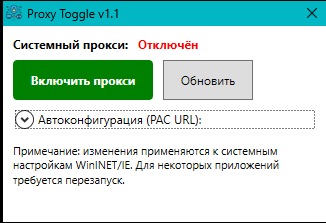
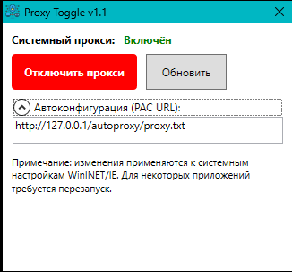

# Switch-SystemProxy
Powershell-скрипт для включения и выключения системного прокси одной кнопкой.

Скрипт также скомпилирован в .exe для запуска пользователями из рута Active Directory: [Switch-SystemProxy.exe](Switch-SystemProxy.exe)

Адрес файла автоконфигурации (PAC):

